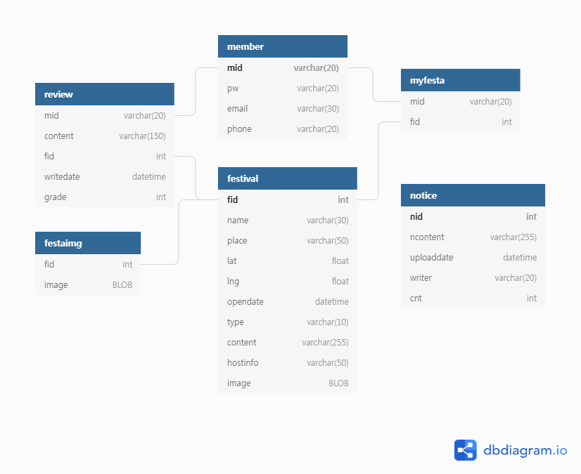

create table festadate(
    opendate date, 
    closedate date,
    fid int,
    FOREIGN KEY (fid) REFERENCES festival (fid)
)
create table festaimg(
    fid int,
    image_name varchar2(6),
    FOREIGN KEY (fid) REFERENCES festival (fid)
)
create table festival(
    fid int primary key,
    name varchar2(100),
    place varchar2(90),
    lat float,
    lng float,
    type varchar2(20),
    fcontent varchar2(900),
    hostinfo varchar2(200)
)
create table memberinfo(
    mid varchar2(40) primary key,
    pw varchar2(32),
    email varchar2(60),
    phone varchar2(60),
    status varchar2(18)
)
create table myfesta(
    mid varchar2(40),
    fid int
)
create table notice(
    nid int primary key,
    ncontent varchar2(600),
    uploaddate varchar2(30),
    cnt int,
    title varchar2(60),
    FOREIGN KEY (mid) REFERENCES memberinfo (mid)
)
create table report(
    report_id int primary key,
    reason varchar2(300),
    mid varchar2(40),
    review_id int,
    FOREIGN KEY (review_id) REFERENCES review (review_id), 
    FOREIGN KEY (mid) REFERENCES memberinfo (mid)
)
create table review(
    review_id int primary key,
    mid varchar2(40),
    fid int,
    rcontent varchar2(300),
    writedate date,
    grade int,
    FOREIGN KEY (fid) REFERENCES festival (fid), 
    FOREIGN KEY (mid) REFERENCES memberinfo (mid)
)

